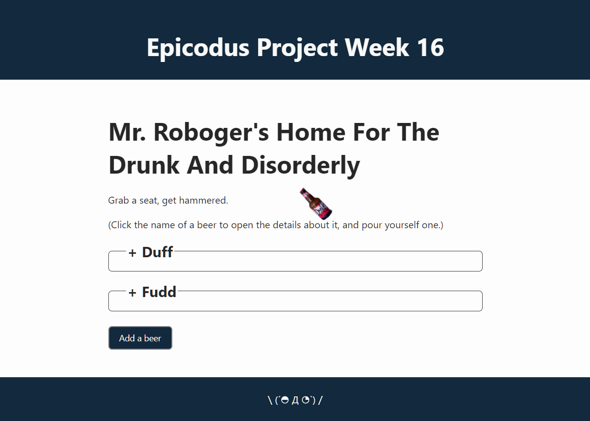

# :beer: Tap Room React :beers:

#### By [Will W.](https://wjwat.com/)

#### Build a SPA using React.

## :computer: Technologies Used

* [React](https://reactjs.org/) / [Create React App](https://create-react-app.dev/)
* JavaScript / [Node](https://nodejs.org/en/) / [npm](https://www.npmjs.com/)
* HTML / CSS / [YACCK](https://github.com/sphars/yacck)

## :memo: Description

A project designed to familiarize myself with React. Built using functional &
class components, and managing various pieces of state.

## :package: Component Diagram

## :gear: Setup/Installation & Usage Instructions

- [Clone this
  repository](https://docs.github.com/en/repositories/creating-and-managing-repositories/cloning-a-repository)
  to your device
- [Install Node &
  npm](https://docs.npmjs.com/downloading-and-installing-node-js-and-npm)
  - This project was developed with Node version 17.9.0, any other version is
    not guaranteed to work.
- [Using your
  terminal](https://www.freecodecamp.org/news/how-you-can-be-more-productive-right-now-using-bash-29a976fb1ab4/)
  navigate to the directory where you have cloned this repo.
- Run one of the scripts below.

### Scripts

In the project directory you can run:

- `npm start` \
    Runs the app in the development mode. \
    Open [http://localhost:3000](http://localhost:3000) to view it in your
    browser. The page will reload when you make changes. \
    You may also see any lint errors in the console.
- `npm run build` \
    Builds the app for production to the `build` folder.\
    It correctly bundles React in production mode and optimizes the build for the
    best performance.

    The build is minified and the filenames include the hashes.\
    Your app is ready to be deployed!

    See the section about
    [deployment](https://facebook.github.io/create-react-app/docs/deployment) for
    more information.
- `npm run eject` \
    **Note: this is a one-way operation. Once you `eject`, you can't go back!**

    If you aren't satisfied with the build tool and configuration choices, you
    can `eject` at any time. This command will remove the single build
    dependency from your project.

    Instead, it will copy all the configuration files and the transitive
    dependencies (webpack, Babel, ESLint, etc) right into your project so you
    have full control over them. All of the commands except `eject` will still
    work, but they will point to the copied scripts so you can tweak them. At
    this point you're on your own.

    You don't have to ever use `eject`. The curated feature set is suitable for
    small and middle deployments, and you shouldn't feel obligated to use this
    feature. However we understand that this tool wouldn't be useful if you
    couldn't customize it when you are ready for it.

## :page_facing_up: Notes

- None at this moment.

## :lady_beetle: Known Bugs

* If any are found please feel free to open an issue or email me at wjwat at
  onionslice dot org

## :warning: License

[MIT License](https://opensource.org/licenses/MIT)

Copyright (c) 2022 Will W. ＼(´◓ Д ◔`)／
